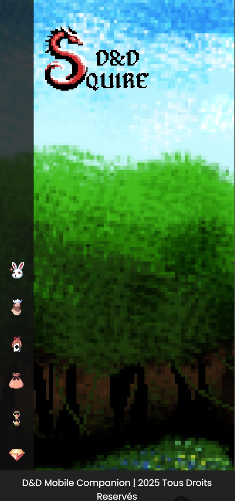

# DnD Squire

## Votre compagnon de jeu de rôle pixel art

https://dndsquire.vercel.app/



## À propos

DnD Squire est une application mobile au style pixel art conçue pour moderniser et simplifier l'expérience des joueurs de jeux de rôle sur table. Fini les fiches de personnage froissées, les calculs approximatifs et les notes éparpillées !

## Fonctionnalités (à venir)

### Gestion de Personnages
- **Création de personnage** : Créez et personnalisez vos héros en quelques clics (done)
- **Avatars personnalisés** : Donnez vie à vos personnages avec des avatars uniques 
- **Sélection facile** : Basculez entre vos différents personnages lors de vos sessions de jeu (done)

### Statistiques et Progression
- **Suivi de niveau** : Gérez la progression de votre personnage
- **Gestion des caractéristiques** : Visualisez et modifiez facilement les statistiques de votre héros

### Inventaire
- **Organisation d'équipement** : Gardez une trace de tous vos objets, armes et trésors
- **Gestion des ressources** : Suivez vos pièces d'or, potions, et autres consommables

### Tracker de Combat
- **Initiative simplifiée** : Organisez l'ordre d'initiative pour des combats fluides
- **Suivi des points de vie** : Gérez la santé de votre personnage en temps réel

### Mode Combat
- **Actions rapides** : Accédez instantanément à toutes vos capacités de combat
- **Gestion des sorts** : Suivez vos emplacements de sorts et temps de recharge

### Log de Combat en Temps Réel
- **Suivi des dégâts** : Si un joueur renseigne avoir perdu X PV, un message "X a perdu X PV" sera affiché pour tous
- **Partage d'informations tactiques** : Communiquez instantanément l'application d'états spéciaux aux ennemis
- **Visibilité partagée** : Tous les joueurs de la campagne voient les mêmes informations en temps réel
- **Historique de combat** : Consultez l'historique des actions pour une meilleure coordination

### Gestion Multi-Campagnes
- **Sélection de campagne** : Basculez facilement entre plusieurs campagnes en cours
- **Personnages spécifiques** : Associez vos personnages à leurs campagnes respectives

## Avantages
- Interface intuitive adaptée aux joueurs de tous niveaux 
- Design pixel art nostalgique et attrayant 
- Remplace efficacement la fiche papier traditionnelle
- Adaptée pour smartphone et tablette

## Installation

```bash
# Cloner le projet
git clone https://github.com/AM-git-dev/DnD-Squire.git

# Installer les dépendances
cd dnd-squire
npm install

# Lancer en mode développement
npm run dev
```

## Technologies
- Vue.js / Nuxt.js
- Pinia pour la gestion d'état
- Firebase pour la base de données et la synchronisation en temps réel
- Stockage local pour les avatars et données persistantes
- Design responsive pour tous les appareils

## Contribuer
Les contributions sont les bienvenues ! N'hésitez pas à proposer des améliorations, signaler des bugs ou ajouter de nouvelles fonctionnalités.

---

DnD Squire - Transformez vos parties de jeu de rôle avec votre écuyer numérique !

AM-Git-Dev et Sheryu pour vous servir !
